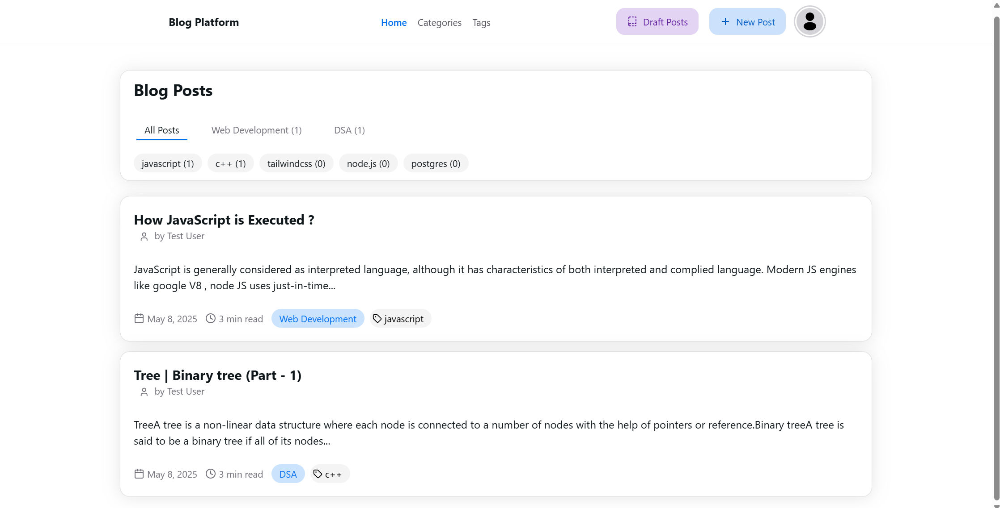

# Blog Platform

## Overview

This is a simple blog platform where users can create, view, and manage blog posts. The platform supports categorizing posts, tagging them, and filtering based on categories and tags.

## Features

- **Create Posts**: Add new blog posts using the "NEW POST" button.
- **Categories**: Organize posts into categories such as "Web Development," "DSA," etc.

**Tags**: Tag posts with relevant keywords like "javascript," "c++," "tailwindcss," etc.

- **Filtering**: Filter posts by categories or tags to quickly find relevant content.
- **Draft Posts**: Save posts as drafts for later publishing.
- **Navigation**: Easily navigate through the platform using the "Home," "Categories," and "Tags" links.

## Usage

1. **Creating a Post**:

   - Click the "NEW POST" button to write a new blog post.
   - Add a title, content, category, and tags before publishing or saving as a draft.

2. **Filtering Posts**:

   - Use the category tabs (e.g., "ALL POSTS," "Web Development," "DSA") to filter posts by category.
   - Use the tag buttons (e.g., "javascript," "c++") to filter posts by specific tags.

3. **Managing Drafts**:

   - Access unpublished posts via the "Draft Posts" button.
   - Edit or publish drafts as needed.

## Screenshots

- **Main Page**: Displays a list of blog posts with their titles, authors, summaries, categories, tags, and publish dates.
- **Filtering**: Categories and tags are displayed above the post list for easy filtering.

## Technologies Used

- HTML, CSS, and JavaScript for the frontend.
- Spring boot for managing posts, categories, and tags.

## Future Improvements

- Add search functionality to find posts by keywords.
- Implement user authentication for secure post management.
- Enhance the UI with more styling and responsiveness.